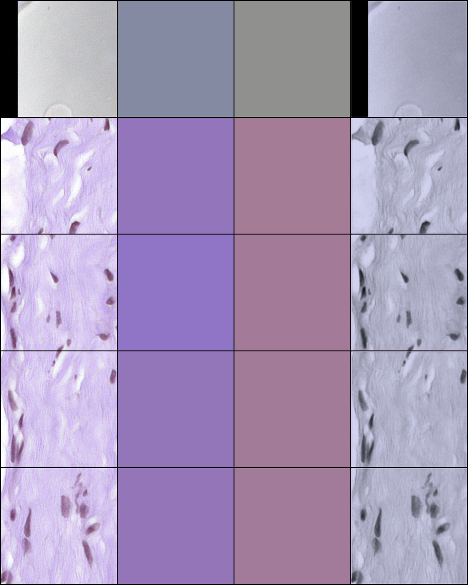
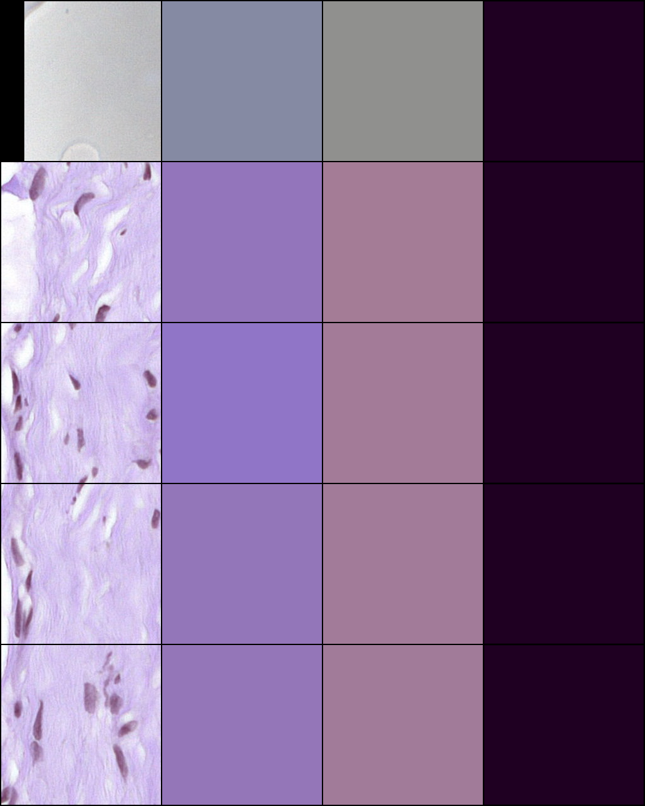

# colourmatrix_estimator

Estimate the H&E stain colour matrix (**W**) of histopathology image patches — first with a classical sparse‑NMF stain‑separation routine, then with lightweight neural networks trained to regress the same matrix directly from an image.

## Overview

In H&E digital pathology, an RGB tissue patch can be modelled (via the Beer–Lambert law) as a stain colour matrix **W** (3×2, one colour vector per stain: Haematoxylin and Eosin) times a per‑pixel stain‑concentration matrix **H**. This repo implements two complementary ways to recover **W**:

1. **Classical estimation** (`Estimate_W.py` + `cal_w.py`) — sparse non‑negative matrix factorization (via [SPAMS](http://thoth.inrialpes.fr/people/mairal/spams/)) on the optical‑density image, producing a per‑patch 3×2 **W** matrix that is written to a CSV. This serves as the ground truth for the learned models.
2. **Learned estimation** — a small fully‑connected regressor (`net.py` / `train.py`) that predicts the six **W** values from an average‑pooled patch, and a dense dilated‑convolution **FullNet** "refiner" (`refiner_model/`) that reconstructs a stain‑consistent RGB image while enforcing that its recovered **W** matches the target.

This is a research/experimental codebase: several data paths and checkpoint names are hard‑coded and must be edited before running (see the notes below).

## Requirements

Python 3 with (core dependencies inferred from the imports):

- `torch==1.7.0`, `torchvision==0.8.1`, `torch-summary` (imported as `torchsummary`)
- `spams` (sparse dictionary learning / NMF)
- `numpy`, `scikit-learn`, `scikit-image`, `Pillow`, `openslide-python`
- `tensorboard` (training logs)

A full, pinned environment snapshot is provided in [`req.txt`](req.txt):

```bash
pip install -r req.txt
```

Note: `req.txt` is a complete `pip freeze` of the original environment and includes packages (e.g. TensorFlow, Jupyter) that the scripts here do not use.

## Usage

The scripts assume 256×256 RGB H&E patches. A small set of example patches ships under [`patches/`](patches). Because input paths and CSV/checkpoint names are hard‑coded in the scripts, edit them to point at your own data before running each stage.

### 1. Estimate ground‑truth W matrices (classical, sparse NMF)

`cal_w.py` globs a directory of patches, calls `Wfast(...)` from `Estimate_W.py` on each, and writes one row per patch to a CSV as `path,w00,w01,w10,w11,w20,w21`:

```bash
python cal_w.py
```

Edit inside `cal_w.py`:
- the `glob(...)` pattern that points to your patches (currently `/home/Drive2/patches_256/*/*/*.jpeg`);
- the output CSV name (currently `patches_256_new.csv`).

`Wfast` samples valid (non‑background) patches, applies the Beer–Lambert transform, factorizes the optical density with `spams.trainDL` (positive **W**/**H**, L2‑normalized stain columns), and sorts columns so column 0 is H and column 1 is E. An example of the resulting CSV format is included as [`patches_and_w.csv`](patches_and_w.csv).

### 2. Train the fully‑connected W regressor

`train.py` trains `FC_48_to_6` (`net.py`) to regress the six **W** values from an average‑pooled patch (with `window_size=64`, a 256×256 patch pools to a 4×4×3 = 48‑dim vector). Arguments, in order:

```bash
python train.py <logs_name> <window_size> <batch_size> <learning_rate> <num_epochs> <weight_decay>
# example:
python train.py w_est_run 64 64 1e-2 100 1e-5
```

It reads `data/w_matrices_0.csv` (train) and `data/w_matrices_1.csv` (val) — point these at the CSV(s) produced in step 1. Checkpoints are saved under `training_logs/<logs_name>/models_v2/` and losses are logged to TensorBoard under `runs/<logs_name>`.

The dataset loader (`dataset.py`) prepends `/home/Drive2/` to each image path from the CSV; adjust that prefix for your setup.

### 3. Train the FullNet colour refiner

`refiner_model/train.py` loads the pretrained FC estimator, builds a 9‑channel input (RGB patch + synthetic H‑stain image + synthetic E‑stain image reconstructed from the target **W**), and trains a `FullNet` (`refiner_model/net_refiner.py`) to output a refined 3‑channel image. The loss combines W‑consistency and reconstruction: `10 * MSE(estimated_W, target_W) + L1(output, input_RGB)`.

```bash
cd refiner_model
python train.py
```

Edit inside `refiner_model/train.py` / `dataset_refiner.py`:
- `path_trained_w_est = "tanpure_csv_w_est.pth"` — the FC checkpoint from step 2;
- the CSV path (`data/w_matrices_0.csv`) and the `/home/Drive2/` image prefix.

### 4. Run refiner inference

`refiner_model/inference.py` loads the pretrained FC estimator plus a trained refiner checkpoint, runs a few batches, and saves side‑by‑side grids of input vs. refined output as `L1_tanpure_output_{n}.png`:

```bash
cd refiner_model
python inference.py
```

Set `refiner_model_path` to your trained FullNet checkpoint before running.

## Results / Figures

Example outputs from the refiner inference stage (`refiner_model/inference.py`), stored under `refiner_model/generator_results/`. Each grid shows input patches alongside the network's refined output:





## Data

The scripts are written for H&E whole‑slide‑image patches; the bundled examples (`patches/patient_020_node_0.tif_*.jpeg`) follow the naming of the [CAMELYON17](https://camelyon17.grand-challenge.org/) lymph‑node histopathology dataset. Any directory of 256×256 RGB H&E patches can be used by adjusting the paths described above.

## Attribution

This repository builds on published methods and third‑party code:

- **Classical W estimation** (`Estimate_W.py`) follows the sparse non‑negative matrix factorization approach to stain separation of Vahadane et al.:

  ```bibtex
  @article{vahadane2016structure,
    title={Structure-Preserving Color Normalization and Sparse Stain Separation for Histological Images},
    author={Vahadane, Abhishek and Peng, Tingying and Sethi, Amit and Albarqouni, Shadi and Wang, Lichao and Baust, Maximilian and Steiger, Katja and Schlitter, Anna Melissa and Esposito, Irene and Navab, Nassir},
    journal={IEEE Transactions on Medical Imaging},
    volume={35},
    number={8},
    pages={1962--1971},
    year={2016},
    publisher={IEEE}
  }
  ```

- **FullNet** (`refiner_model/net_refiner.py`, `fullnet.py`, `fullnet_2.py`) is the dense dilated‑convolution architecture by Hui Qu (credited in the source docstrings):

  ```bibtex
  @inproceedings{qu2019improving,
    title={Improving Nuclei/Gland Instance Segmentation in Histopathology Images by Full Resolution Neural Network and Spatial Constrained Loss},
    author={Qu, Hui and Yan, Zhennan and Riedlinger, Gregory M and De, Subhajyoti and Metaxas, Dimitris N},
    booktitle={International Conference on Medical Image Computing and Computer-Assisted Intervention (MICCAI)},
    pages={378--386},
    year={2019},
    organization={Springer}
  }
  ```

## License

Released under the [MIT License](LICENSE).
